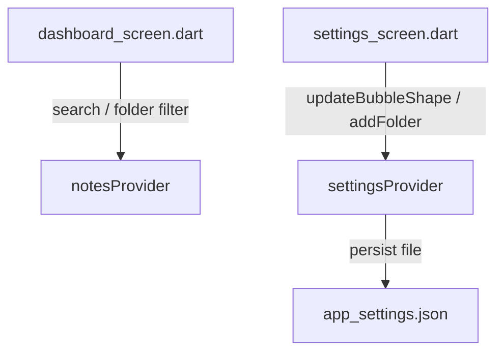

# Dashboard & Settings Map

## Purpose

The Dashboard is the central interface of the app, providing options to view, filter, sort, search, and manage notes. The settings section allows configuring global properties like default floating bubble dimensions, shapes, and category folders.

---

# Depends On

- **Riverpod**: State management.
- **`notesProvider`**: Needed to display and search note cards, and trigger overlay toggles.
- **`settingsProvider`**: Needed to display current folders, control grid layout states, and configure global bubble dimensions.
- **Path Provider**: Persists `app_settings.json` locally under document directories.

---

# Main Providers

- `settingsProvider` (`StateNotifierProvider<SettingsNotifier, AppSettings>`): Handles CRUD of settings JSON file (`app_settings.json`), folders list management, grid/list view configurations, and global bubble parameters (size and shape).

---

# Main Screens

- `dashboard_screen.dart` (`lib/features/dashboard/views/dashboard_screen.dart`): Primary dashboard screen displaying notes lists, searching note title/content, folder selection tabs, floating action button to create new notes, and option to trigger overlay services.
- `settings_screen.dart` (`lib/features/dashboard/views/settings_screen.dart`): UI panels to configure global bubble shape (circle, square, rounded_rect), size slider, folder customization fields (add/remove), database clearing utilities, and quick instruction guides.

---

# Data Flow

---

# Risks

- **Settings Lockups**: Reading/writing `app_settings.json` concurrently could corrupt files. Defaults are kept as fallback.
- **Folder Deletions**: Deleting a folder in settings must reset the corresponding notes' folder names back to empty values in SQLite database to prevent ghost categories.
- **Overlay Scaling**: Changing global bubble size/shape must propagate dynamically to all currently running Kotlin overlays.
