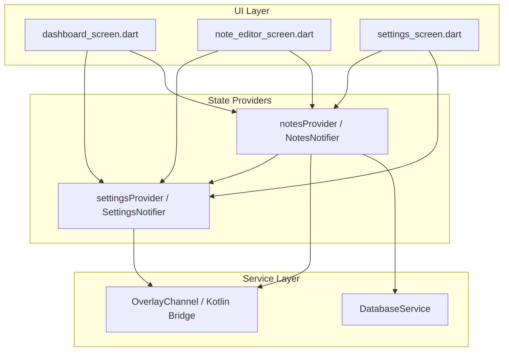

# Dependencies Map

## Overall Dependency Graph

---

## Detailed Component Dependencies

### `notesProvider` (StateNotifier)
- **Depends on**:
  - `DatabaseService` (SQLite backend CRUD operations)
  - `OverlayChannel` (Kotlin IPC / Overlay rendering triggers)
  - `settingsProvider` (Reads global bubble size & shape properties when generating/updating overlays)
- **Used by**:
  - `dashboard_screen.dart` (Reads notes lists, handles folder removal synchronizations)
  - `note_editor_screen.dart` (Creates, deletes, updates note fields and checklist items)
  - `settings_screen.dart` (Updates or resets notes folders and resets data)

### `settingsProvider` (StateNotifier)
- **Depends on**:
  - `path_provider` (To fetch the documents directory for `app_settings.json` persistence)
- **Used by**:
  - `notesProvider` (To resolve default bubble settings on creation)
  - `dashboard_screen.dart` (To read current list of folders and toggles)
  - `settings_screen.dart` (To modify user options, shapes, custom sizes)
  - `note_editor_screen.dart` (To read default folder categories)

### `DatabaseService` (Singleton)
- **Depends on**:
  - `sqflite` (SQLite core package)
  - `path` (To build platforms database directory URL)
- **Used by**:
  - `notesProvider` (To fetch, edit, or sync SQL rows with UI states)

### `OverlayChannel` (Platform Integration)
- **Depends on**:
  - `MethodChannel` (`com.example.floating_note/overlay`)
  - `EventChannel` (`com.example.floating_note/overlay_events`)
- **Used by**:
  - `notesProvider` (To command overlay windows to spawn, synchronize positions, expand, minimize, lock, or disappear)
