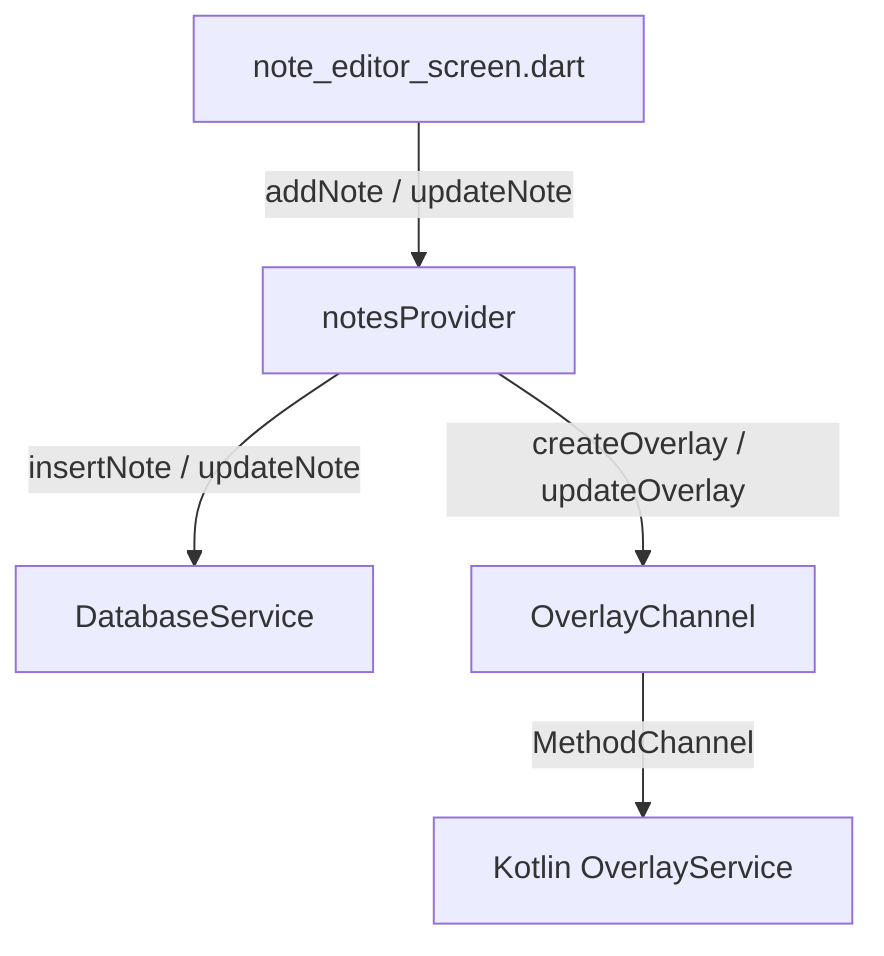

# Notes Feature Map

## Purpose

The notes feature allows users to create text notes or checklists, customize their color/opacity/icons, organize them into folders, and launch them as native floating window overlays that stay on top of other apps.

---

# Depends On

- **sqlite / sqflite**: Data persistence for notes and nested checklist items.
- **Riverpod**: State management for updates.
- **OverlayChannel**: Communications with the native Android overlay layer.
- **uuid**: Unique identifiers generator for notes and checklist items.

---

# Main Providers

- `notesProvider` (`StateNotifierProvider<NotesNotifier, List<Note>>`): Controls all CRUD logic, folder removals, and callbacks from the native platform overlay channel when positions or properties change outside the Flutter UI.

---

# Main Screens

- `note_editor_screen.dart` (`lib/features/notes/screens/note_editor_screen.dart`): Rich editor interface to rename title, content, type (plain text or checklist), add checklist items, configure bubble shape/size, note background color, and transparency slider.

---

# Main Services

## DatabaseService
Executes SQLite queries within transactions to guarantee integrity between notes and checklist items.

## OverlayChannel
Native method bridge to create, update, remove, and toggle floating note overlays on the screen.

---

# Data Flow

---

# Risks

- **Sync Loops**: Kotlin overlays can update note positions, which notifies Dart, which updates the Riverpod state. The state update must not trigger another channel call back to Kotlin, preventing infinite position updates.
- **Alert Window Permissions**: On Android, apps must have overlay permission. If not granted, spawning overlays will crash or fail silently.
- **Database Drift**: Inconsistent cleanup of checklist items if notes are deleted without transaction cascades.

---

# Future Improvements

- **Markdown Support**: Support simple markdown styling in notes content.
- **Folder Sync**: Cloud storage sync for folders and settings.
- **Rich Media**: Embed audio clips or quick drawings inside floating panels.
