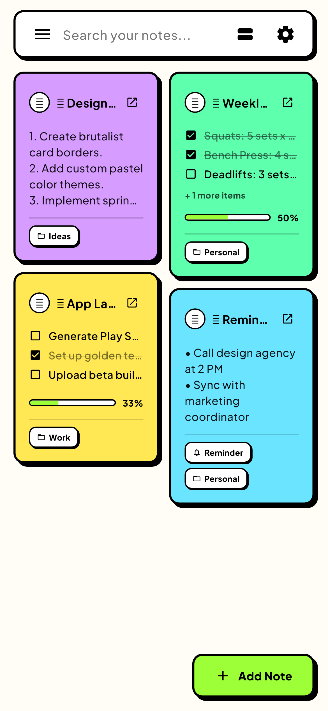
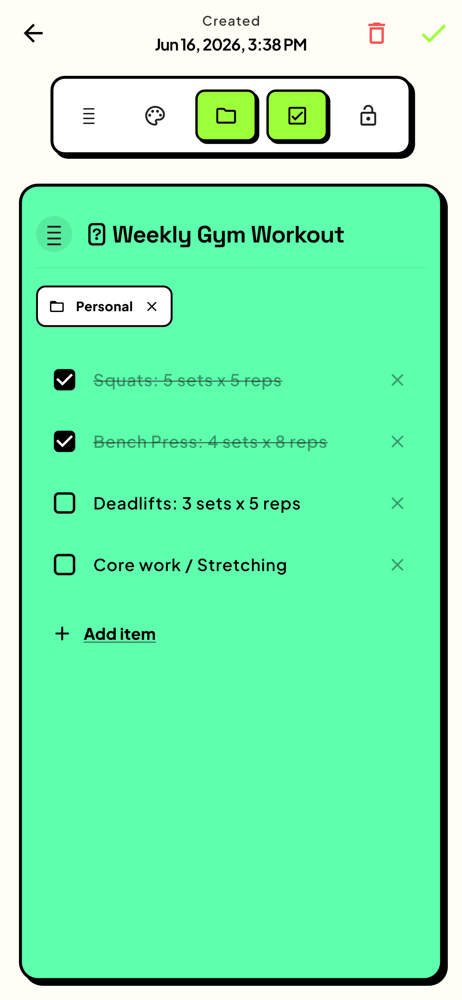
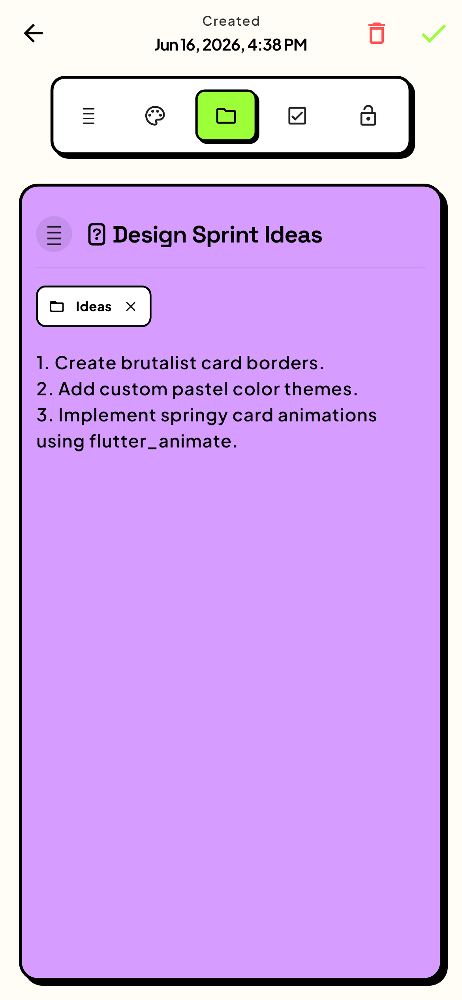
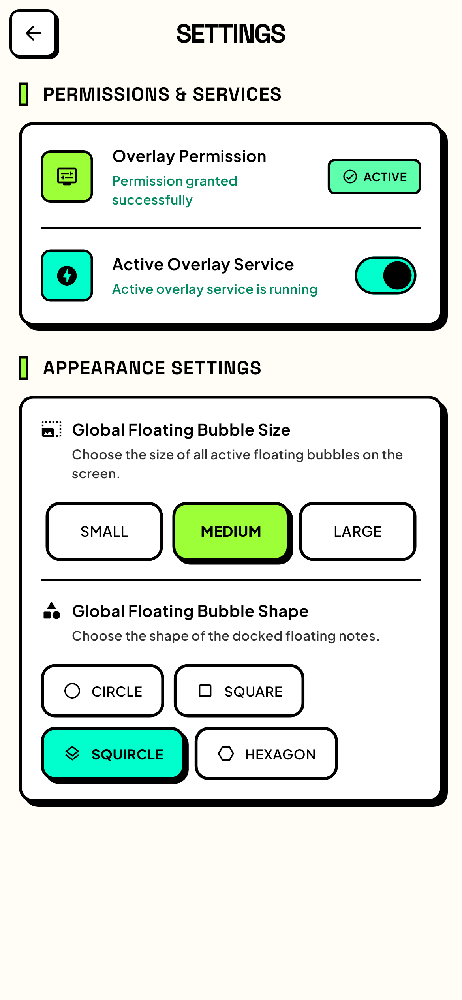

#  Floating Note (Bubble Note)

A utility note capture application that leverages native Android Window overlays for floating context capture directly on top of third-party apps.

## Core Features
* **Android Window Overlay**: Runs a background service with SYSTEM_ALERT_WINDOW permissions for a floating bubble capture screen.
* **Bidirectional Platform Bridge**: Synchronizes real-time note checklists using MethodChannel/EventChannel between Dart and native Kotlin contexts.
* **Fast Offline DB**: Employs SQLite database structures for instant local storage, editing, and searches.
* **Neo-Brutalist Custom UI**: Uses OLED-friendly dark themes, border designs, and press-depth micro-animations.

## Golden Test Screenshots

| Dashboard | Note Editor (Checklist) | Note Editor (Text) | Settings Screen |
|---|---|---|---|
|  |  |  |  |
